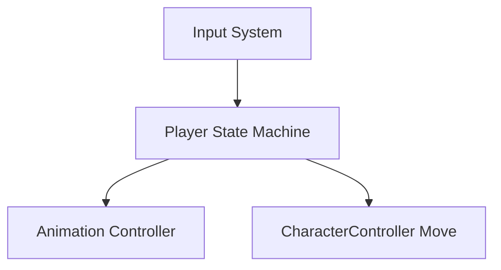

# PROJECTWIKI.md

## 1. Project Overview
- Goal: Unity third-person character controller and combat prototype.
- Scope: Player movement, animation state machine, and input handling.

## 2. Architecture Design

## 3. Architecture Decision Records (ADR)
- Directory: `docs/adr/` (not present yet)

## 4. Design Decisions & Technical Debt
- Input deadzone is applied in player state transitions to avoid lingering Move state.
- Animation transitions normalize mixer weights to eliminate blend residue, with optional state logging.

## 5. Module Docs
- Player State Machine
  - Files: `Assets/Scripts/Player/State/PlayerIdleState.cs`, `Assets/Scripts/Player/State/PlayerMoveState.cs`
  - Responsibility: transition between Idle and Move based on input values.
- Animation Controller
  - Files: `Assets/Scripts/Player/Animation/AnimationController.cs`, `Assets/Scripts/Player/Animation/BlendAnimationNode.cs`, `Assets/Scripts/Player/Animation/SingleAnimationNode.cs`
  - Responsibility: play single/blend clips and manage transition weights with debug output.

## 6. API Reference
- No public API surface documented.

## 7. Data Model
- Not applicable for current scope.

## 8. Core Flow
- Input -> State transition -> Animation + Movement update

## 9. Dependency Map
- UnityEngine, JKFrame, Sirenix.OdinInspector (existing project dependencies)

## 10. Maintenance Notes
- Keep input deadzone consistent in Idle/Move to avoid oscillation.
- Use state change logs to diagnose unexpected transitions.
- Enable `logAnimationState` in the AnimationController to inspect clip names and mixer weights.

## 11. Glossary
- Deadzone: Threshold below which input is treated as zero.

## 12. Change Log
- See `CHANGELOG.md`.
